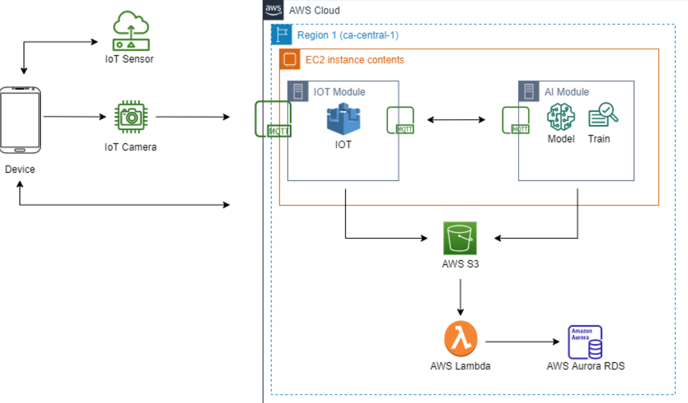
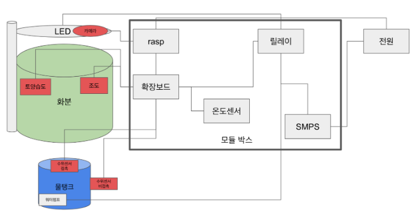
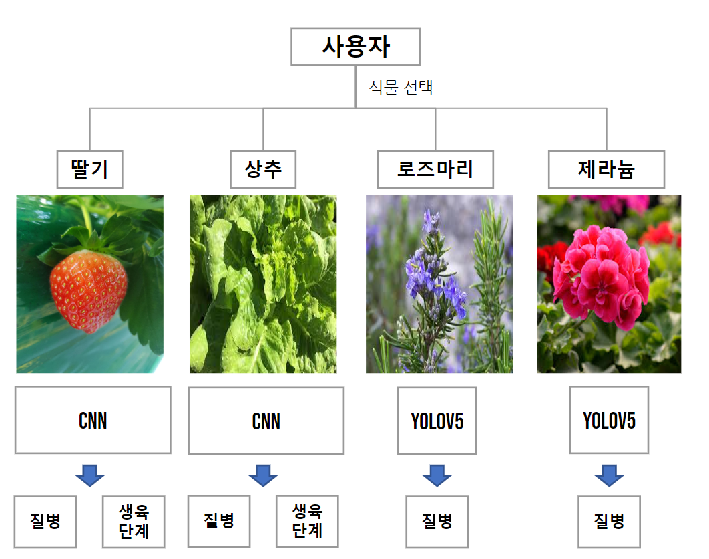

# K-digital Training 
## 멀티캠퍼스 융복합 프로젝트 6조
### 네 식물 내가 살려
### 질병, 생육단계 판단 스마트 화분 모듈

---
**기획**  
배경 : 
반려식물 및 관련 상품의 수요와 매출 증가   
대상 :
반려식물을 잘 키우고 싶은 식집사들  
기능 :
스마트화분(자동화), 병충해 및 생장단계 판단,
생육환경 기록 보관  

:technologist: **Tech**  
AWS RDS·Lambda·EC2·S3, Raspberry pi, Arduino,
 mqtt, mosquitto, Python, R, Tensorflow, Pytorch, Android, Flask

**Service Architecture**

  
**화분 구조도**

   
**질병, 생육단계 판단 모델**

딸기&상추 : multi output model, inception resnet v5  
로즈마리&제라늄 : YoloV5

<table style="text-align: center; width: 50%;">
<caption>Team Member</caption>
 <tr>
  <td>BIGDATA</td>
  <td>AI</td>
  <td>CLOUD</td>
  <td>IoT</td>
 </tr>
 <tr>
<td>오병권 이준영</td>
<td>이희경 
    이지연 
    박현상 
     조재성 </td>
<td>정민우</td>
<td>이경훈 이채환</td>
 </tr>
</table>
---
- [기획안](https://docs.google.com/document/d/13RwllnkEg-1lDlXhFnggXsii04QX7ZwL/edit)
- [발표자료](https://drive.google.com/drive/u/0/folders/16c9qIBA_35K5xlysDiCqXnJXjSKqKTHJ?lfhs=2)
- [수행일지](https://drive.google.com/drive/u/0/folders/1ALXE64ULPDJGkL54ilDH0NqmET6CPOJm?lfhs=2)
- [아키텍쳐](https://drive.google.com/drive/u/0/folders/1Dp07hoedp3BjsDCKrko83T102GfunTp6?lfhs=2)
- [참고자료](https://drive.google.com/drive/u/0/folders/1QuqC4tK8CgNL1tUE-vD7sEY8opHZlkkx?lfhs=2)
- [WBS](https://docs.google.com/spreadsheets/d/1TBv9vK4I84vU_pYhTZf42qAZG9I6j2U7/edit?rtpof=true)
<!-- [소스코드](https://drive.google.com/drive/u/0/folders/1MN6rRawpJmiLRsWjcs4LNaZlBtGrE7Ta?lfhs=2)-->
